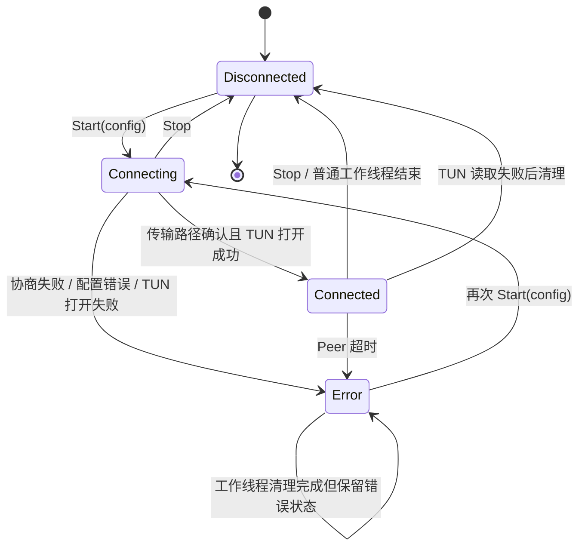
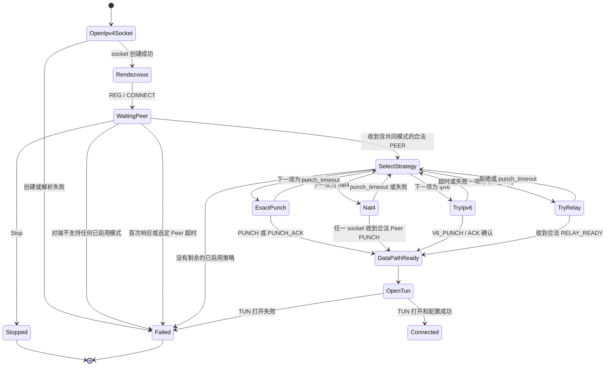
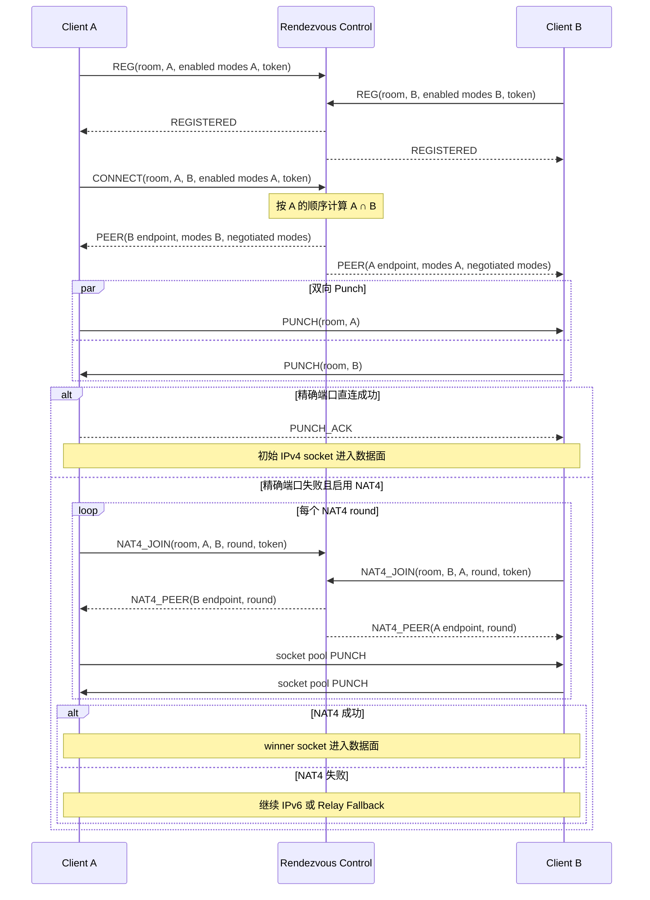
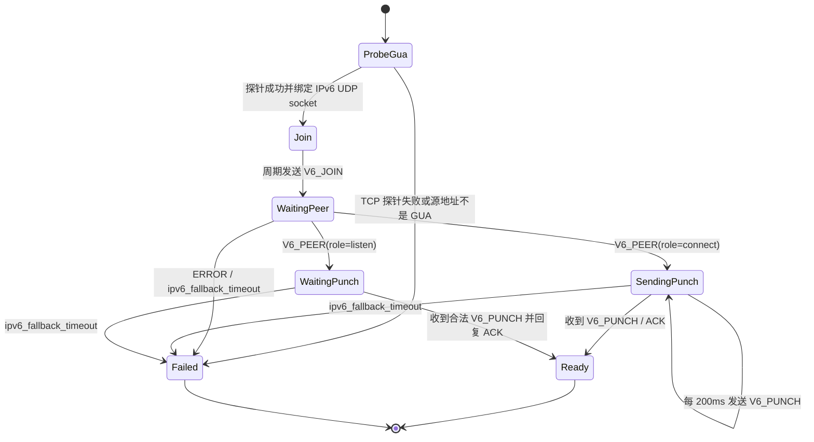
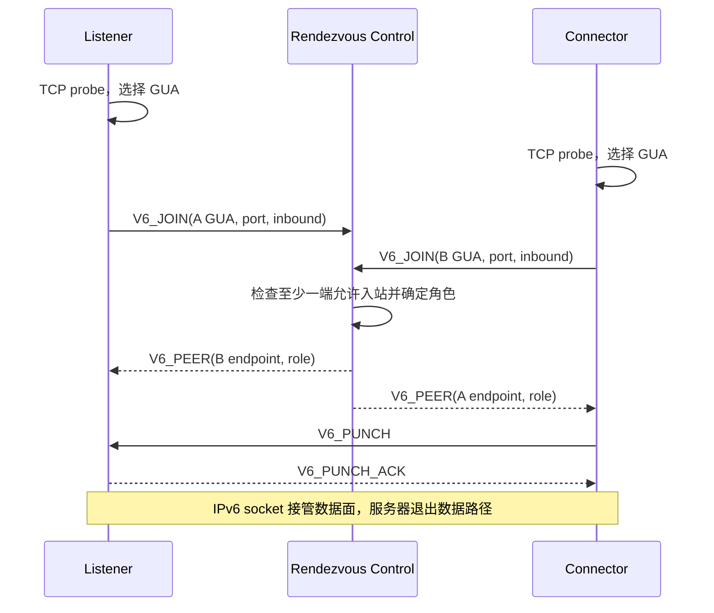
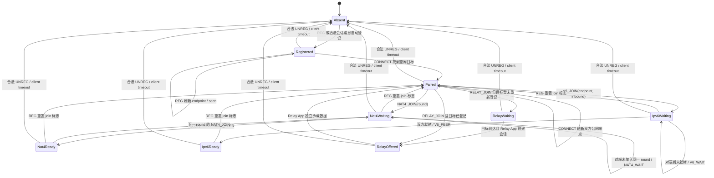
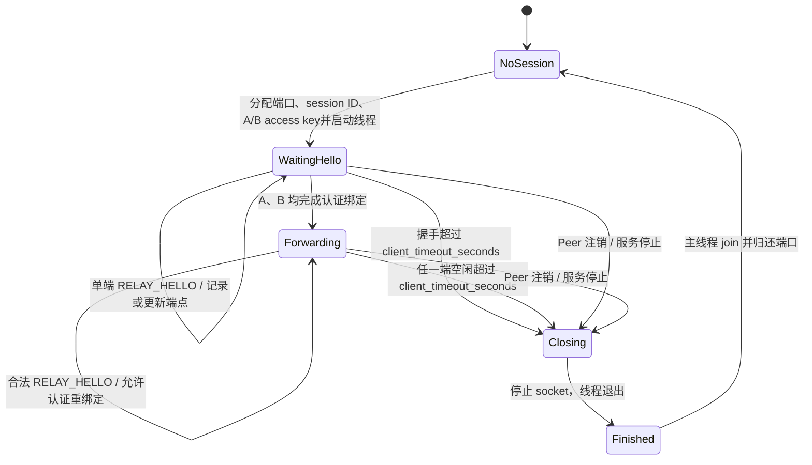
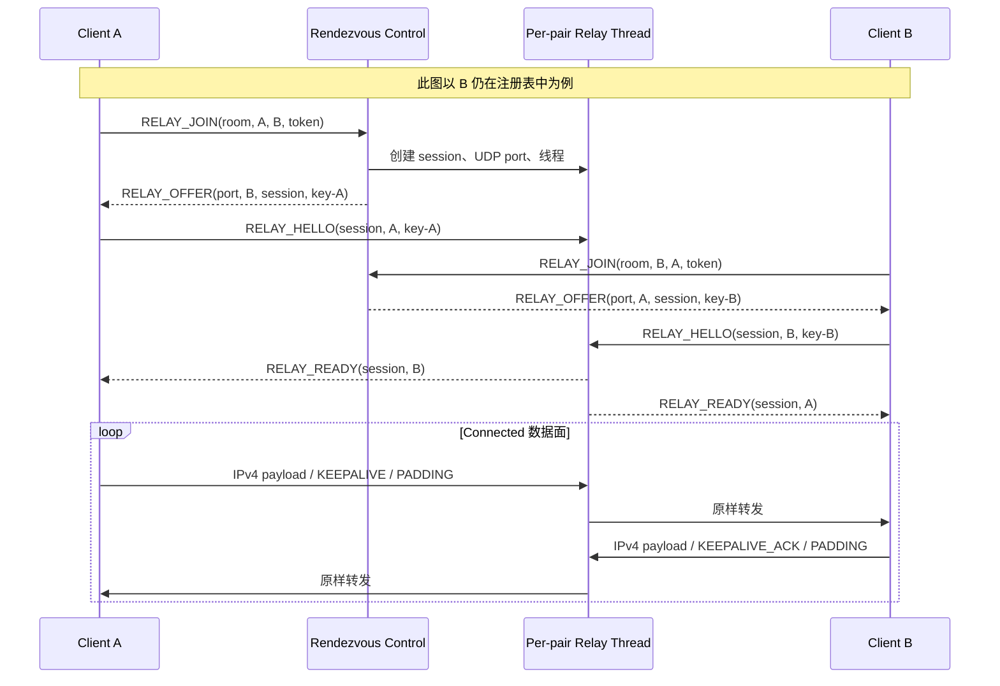

# EasyTunnel 状态机与协商时序

本文汇总客户端和会合服务器的状态切换。图中的状态名称用于说明逻辑；除
`TunnelState` 外，部分状态是对多个字段和循环阶段的归纳，并不都对应代码中的同名
枚举。

相关实现：

- 客户端总控：[tunnel_engine.cpp](../tunnel_engine.cpp)
- Peer 选择：[peer_selection.cpp](../peer_selection.cpp)
- IPv4/NAT4：[nat_traversal.cpp](../nat_traversal.cpp)、[nat4_traversal.cpp](../nat4_traversal.cpp)
- IPv6 Fallback：[ipv6_fallback.cpp](../ipv6_fallback.cpp)
- IPv4 Relay Fallback：[ipv4_relay_fallback.cpp](../ipv4_relay_fallback.cpp)
- 会合控制面：[server.cpp](../rendezvous/server.cpp)、[registry.cpp](../rendezvous/registry.cpp)
- Relay 数据面：[ipv4_relay_app.cpp](../rendezvous/ipv4_relay_app.cpp)

## 1. 客户端顶层状态

客户端对 UI 暴露四种 `TunnelState`：

说明：

- `Start` 只负责置为 `Connecting` 并创建客户端工作线程，不会立即打开 TUN。
- 只有传输路径完成确认后才打开 TUN，然后进入 `Connected`。
- Peer keepalive 超时会显式进入 `Error`；普通停止最终进入 `Disconnected`。
- 错误状态下工作线程仍会关闭 UDP socket 和 TUN，但保留 `Error` 供 UI 展示。

## 2. 客户端连接子状态机

四种策略都要求先通过 IPv4 会合通道的 `PEER` 匹配到明确目标。双方注册时上报已启用
模式，服务端按连接发起方的顺序取能力交集，并把协商结果随 `PEER` 返回双方。匹配完成
后，引擎按该协商顺序选择策略；任一策略成功即进入数据面，失败则继续下一项。没有共同
模式时，发起方立即失败，等待方继续保持注册状态。

普通 NAT、增强 NAT4 和 Relay 分别使用独立的 `punch_timeout`；IPv6 使用
`ipv6_fallback_timeout`。

### 2.1 各阶段的 socket 接管

| 成功路径 | 最终数据 socket | 客户端保存的 Peer 端点 |
| --- | --- | --- |
| 精确 IPv4 Punch | 初始 IPv4 会合 socket | Peer 实际 IPv4 公网端点 |
| NAT4 | socket 池中收到合法 PUNCH 的 winner socket | PUNCH 的真实来源端点 |
| IPv6 Fallback | 新建的 IPv6 UDP socket，成功后替换原 socket | 对端 IPv6 GUA 与端口 |
| IPv4 Relay | IPv4 relay 协商 socket | 会合服务器 IP 与本会话 relay 端口 |

进入 `Connected` 后，TUN→网络与网络→TUN 两个数据线程只使用表中的最终 socket 和
端点。Relay 不改变数据线程：服务端转发后，客户端看到的 UDP 来源始终是已确认的
relay 端口。

## 3. 客户端完整协商时序

## 4. IPv6 Fallback 状态与时序

客户端先验证实际可用的 IPv6 GUA，再创建最终 IPv6 UDP socket。服务器只分配角色和
交换端点，不转发 IPv6 数据。

若双方都允许入站，`peer_id` 字典序较小的一端为 `listen`；只有一端允许入站时，该端
固定为 `listen`。

## 5. 会合服务器控制面状态

会合服务器主线程始终只监听控制端口。每个客户端条目由 `pairedWith`、
`nat4Joined/nat4Round` 和 `ipv6Joined` 等字段共同描述，因此以下是逻辑状态投影，并非
互斥枚举。

关键规则：

- `LIST` 只返回 `pairedWith` 为空的客户端。
- `REG` 和 `CONNECT` 都携带本端已启用模式；首个有效 `CONNECT` 决定协商顺序。
- 双方能力没有交集时只向发起方返回 `no-common-traversal-mode`，不占用等待方。
- `CONNECT`、`NAT4_JOIN`、`V6_JOIN` 和 `RELAY_JOIN` 都会校验 room、Peer ID 和 token。
- 任一方已与第三方配对时返回 `peer-busy`。
- 客户端过期或注销后，其他条目中指向它的 `pairedWith` 会被清理。
- 合法 `UNREG` 还会通知 Relay App 立即停止包含该 Peer 的活动会话。

## 6. IPv4 Relay App 状态机

Relay App 与注册表分离。注册表确认双方身份和配对关系后才调用 Relay App；每对 Peer
使用一个 UDP socket、一个公网端口和一个工作线程。

Relay 端口范围决定最大并发会话数。线程仅接收本会话端口的数据，且只转发来自已经
认证绑定端点的数据报；未知来源和 access key 错误的 `RELAY_HELLO` 会被丢弃。

### 6.1 Relay 控制面与数据面时序

`RELAY_JOIN` 与 `RELAY_HELLO` 都是幂等的。Offer 丢失时服务器返回同一会话信息；
Hello 或 Ready 丢失时客户端继续发送 Hello，线程在双方已绑定后重新发送 Ready。
如果 B 已从注册表暂时消失，A 首次请求会收到 `RELAY_WAIT`；B 的 `RELAY_JOIN` 重新
登记并创建会话后，A 重发 `RELAY_JOIN` 即可取得同一会话的 Offer。

## 7. 超时、错误与停止汇总

| 位置 | 条件 | 后续状态/动作 |
| --- | --- | --- |
| 会合首次响应 | 5 秒无合法服务端响应 | 客户端 `Error` |
| 指定 Peer 等待 | `punch_timeout` 内未匹配 | 客户端 `Error` |
| 模式能力协商 | 双方没有共同启用模式 | 发起方立即 `Error`，等待方继续在线 |
| 空目标等待模式 | 未收到 PEER | 持续等待，直到 Stop |
| 普通 NAT | `punch_timeout` | 策略列表下一项或 `Error` |
| NAT4 | `punch_timeout` | 策略列表下一项或 `Error` |
| IPv6 直连 | `ipv6_fallback_timeout` | 策略列表下一项或 `Error` |
| IPv4 Relay 协商 | 独立的 `punch_timeout` | 策略列表下一项或 `Error` |
| 已连接客户端 | `peer_timeout` 无合法 Peer 流量 | 客户端 `Error` |
| 服务端注册表 | `client_timeout_seconds` 未刷新 | 删除客户端条目 |
| Relay 未就绪/已连接 | `client_timeout_seconds` 达到对应超时 | 线程退出并回收端口 |
| 任意客户端阶段 | 用户 Stop | 停止循环、关闭 socket、释放 TUN |
| 会合服务器停止 | running=false | 停止主循环和全部 relay 线程并 join |

## 8. 修改状态机时的同步清单

后续新增或调整协商阶段时，应同步检查：

1. 客户端是否保留了正确的 `matchedPeerId`、最终 socket 和最终 Peer 端点；
2. 控制消息是否只接受来自配置的会合服务器或已确认数据端点；
3. 服务端重复请求是否幂等，旧 round 或旧 session 是否会污染新连接；
4. Stop、超时、注销和服务重启是否都能唤醒阻塞收包并 join 线程；
5. Console、TUI、GUI、服务端 TUI、示例配置和本文档是否保持一致。
