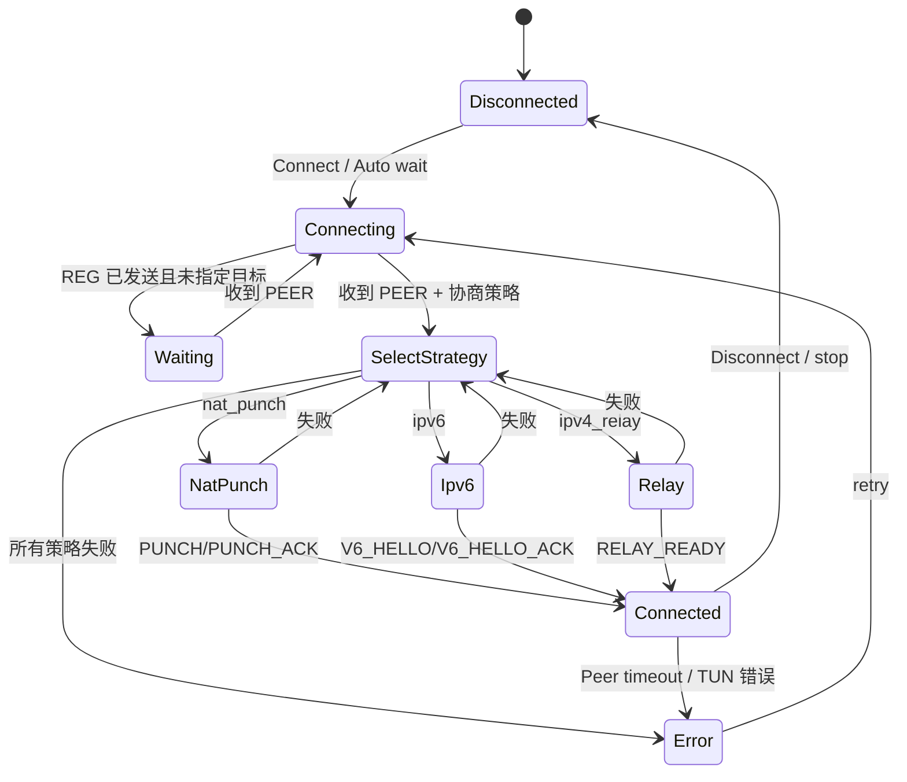
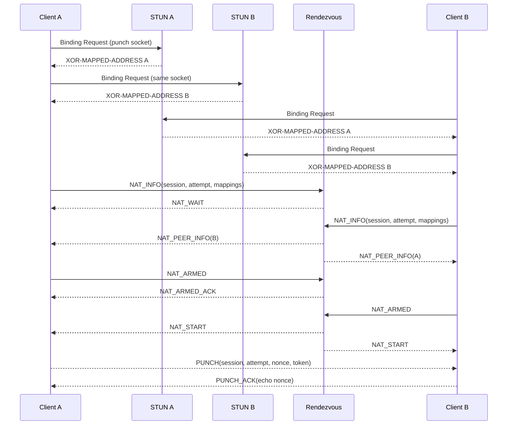
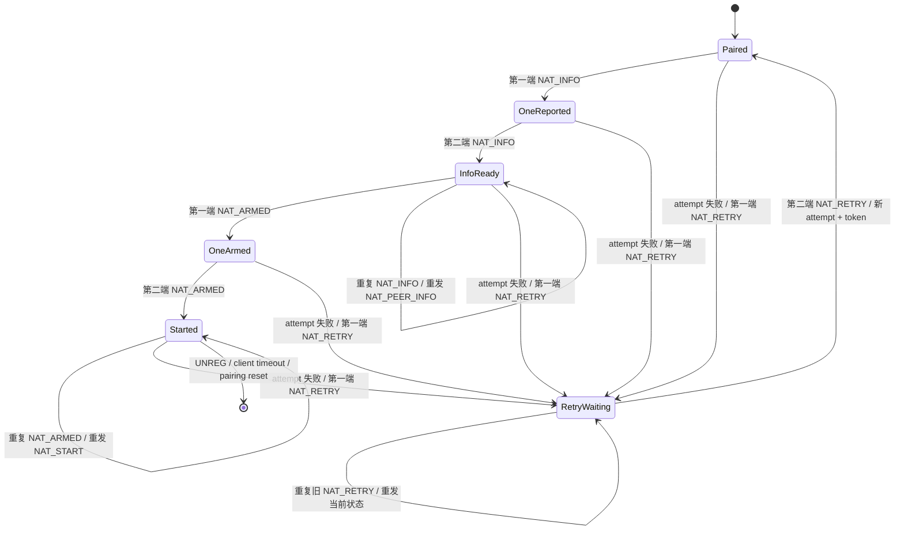
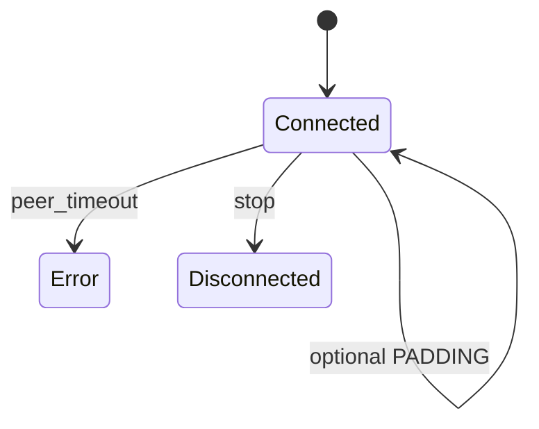

# EasyTunnel 状态机

本文描述客户端、会合服务器和数据面的当前状态。Adaptive NAT Punch 的报文字段与
端口计划细节见 [nat-traversal.md](nat-traversal.md)。

## 客户端总状态


```mermaid
stateDiagram-v2
    [*] --> Disconnected
    Disconnected --> Connecting: Connect / Auto wait
    Connecting --> Waiting: REG 已发送且未指定目标
    Waiting --> Connecting: 收到 PEER
    Connecting --> SelectStrategy: 收到 PEER + 协商策略
    SelectStrategy --> NatPunch: nat_punch
    SelectStrategy --> Ipv6: ipv6
    SelectStrategy --> Relay: ipv4_relay
    NatPunch --> Connected: PUNCH/PUNCH_ACK
    Ipv6 --> Connected: V6_HELLO/V6_HELLO_ACK
    Relay --> Connected: RELAY_READY
    NatPunch --> SelectStrategy: 失败
    Ipv6 --> SelectStrategy: 失败
    Relay --> SelectStrategy: 失败
    SelectStrategy --> Error: 所有策略失败
    Connected --> Error: Peer timeout / TUN 错误
    Connected --> Disconnected: Disconnect / stop
    Error --> Connecting: retry
```

界面中的 `Connecting` 会附带当前阶段文本，例如 `Trying Adaptive NAT Punch`。

## 配对与协议版本

客户端通过 `REG` 上报能力；主动端同时发 `CONNECT`。服务端取双方能力交集并保留
主动端顺序。当前能力名为：

```text
nat_punch
ipv6
ipv4_relay
```

旧配置文件中的 `nat` 和 `nat4` 在客户端加载时合并为 `nat_punch`。线上协议不继续
发布旧能力，客户端和会合服务器应一起升级。

成功配对的 `PEER` 包含对端控制端点、能力交集、随机 NAT session、attempt ID、
initiator/responder 角色、协议版本和 punch token。Peer 列表中只显示尚未配对的节点。

## Adaptive NAT Punch


```mermaid
sequenceDiagram
    participant A as Client A
    participant SA as STUN A
    participant SB as STUN B
    participant R as Rendezvous
    participant B as Client B

    A->>SA: Binding Request (punch socket)
    SA-->>A: XOR-MAPPED-ADDRESS A
    A->>SB: Binding Request (same socket)
    SB-->>A: XOR-MAPPED-ADDRESS B
    B->>SA: Binding Request
    SA-->>B: XOR-MAPPED-ADDRESS A
    B->>SB: Binding Request
    SB-->>B: XOR-MAPPED-ADDRESS B
    A->>R: NAT_INFO(session, attempt, mappings)
    R-->>A: NAT_WAIT
    B->>R: NAT_INFO(session, attempt, mappings)
    R-->>A: NAT_PEER_INFO(B)
    R-->>B: NAT_PEER_INFO(A)
    A->>R: NAT_ARMED
    R-->>A: NAT_ARMED_ACK
    B->>R: NAT_ARMED
    R-->>A: NAT_START
    R-->>B: NAT_START
    A-->>B: PUNCH(session, attempt, nonce, token)
    B-->>A: PUNCH_ACK(echo nonce)
```

控制 socket 负责 REG/CONNECT；独立 punch socket 负责 STUN、`NAT_INFO` 和 Peer 打洞。
成功时关闭控制 socket，并让 punch socket 直接进入数据面；失败时关闭 punch socket，
控制 socket 仍可继续 IPv6/Relay。

当前计划支持 easy/easy Direct、regular/easy Range、hard/hard regular dual-range，
easy/random 的 bounded random sender/receiver，以及 regular/random 的 mixed random
sender + range receiver。random/random 与 multi-public-IP 返回明确错误并进入下一个策略。

## 会合服务器 NAT 状态

每个已配对客户端保存同一份 session/attempt/token，以及本端报告：


```mermaid
stateDiagram-v2
    [*] --> Paired
    Paired --> OneReported: 第一端 NAT_INFO
    OneReported --> InfoReady: 第二端 NAT_INFO
    InfoReady --> OneArmed: 第一端 NAT_ARMED
    OneArmed --> Started: 第二端 NAT_ARMED
    Started --> Started: 重复 NAT_ARMED / 重发 NAT_START
    InfoReady --> InfoReady: 重复 NAT_INFO / 重发 NAT_PEER_INFO
    Paired --> RetryWaiting: attempt 失败 / 第一端 NAT_RETRY
    OneReported --> RetryWaiting: attempt 失败 / 第一端 NAT_RETRY
    InfoReady --> RetryWaiting: attempt 失败 / 第一端 NAT_RETRY
    OneArmed --> RetryWaiting: attempt 失败 / 第一端 NAT_RETRY
    Started --> RetryWaiting: attempt 失败 / 第一端 NAT_RETRY
    RetryWaiting --> Paired: 第二端 NAT_RETRY / 新 attempt + token
    RetryWaiting --> RetryWaiting: 重复旧 NAT_RETRY / 重发当前状态
    Started --> [*]: UNREG / client timeout / pairing reset
```

服务端不运行 STUN、不分类 NAT、不构造端口计划，也不转发 TUN 数据。客户端记录按
`client_timeout_seconds` 清理，配对端消失时另一端状态同时复位。

## IPv6 与 Relay

IPv6 策略仍通过 `V6_JOIN` 交换 GUA、UDP 端口和 listen/connect 角色；至少一端必须
允许 inbound。Relay 策略仍通过 `RELAY_JOIN` 进入独立 UDP relay 会话。这两条路径的
TUN 数据格式没有改变。

## 数据面

连接成功后，winner socket 和确认后的 Peer 端点保持不变：


```mermaid
stateDiagram-v2
    [*] --> Connected
    Connected --> Connected: TUN IPv4 <-> UDP
    Connected --> Connected: KEEPALIVE / KEEPALIVE_ACK
    Connected --> Connected: optional PADDING
    Connected --> Error: peer_timeout
    Connected --> Disconnected: stop
```

客户端只把确认 Peer 端点发来的 IPv4 payload 写入 TUN。控制包先由
`HandlePeerControl` 消费。`keepalive_interval` 和 `peer_timeout` 只属于连接后的
liveness，不影响打洞计划。

## 主要超时

| 阶段 | 配置/固定值 | 结果 |
|---|---|---|
| 首次会合响应 | 5 秒 | `Rendezvous server did not respond` |
| 主动端选 Peer | `punch_timeout` | Error |
| 单次 Adaptive NAT attempt | `punch_timeout` | 重试或下一个策略 |
| 等待双方同步新 attempt | `punch_timeout` + 5 秒 | 下一个策略 |
| IPv6 | `ipv6_fallback_timeout` | 下一个策略 |
| Relay 协商 | `punch_timeout` | 下一个策略 |
| 已连接 Peer liveness | `peer_timeout` | Error |

Adaptive NAT 最多执行 `nat_punch_attempt_limit` 次 attempt（默认 3，最大 10），
每次使用新的 attempt ID 和 punch token。`nat_punch_profile` 控制 Range 扩大速度、
发送间隔、随机 socket/目标规模和单 attempt 报文预算；mixed random/range 使用相同
资源上限，低 TTL 和发送延迟变体仍在[新 NAT 穿透 TODO](新NAT穿透TODO.md)。
